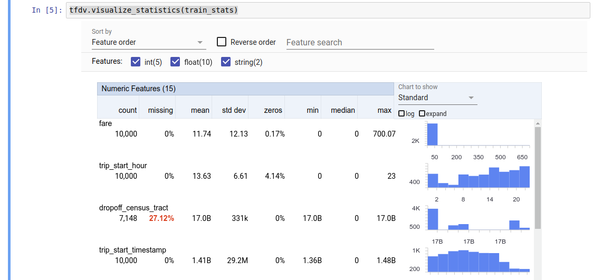
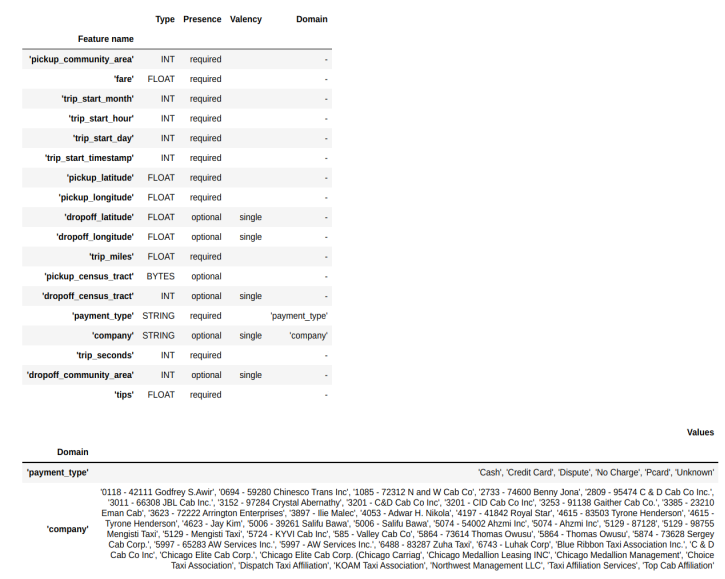
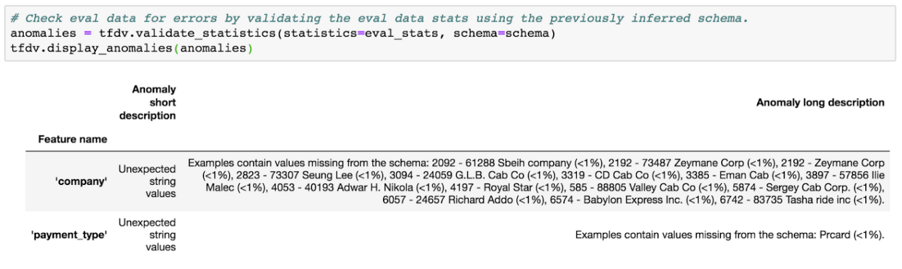
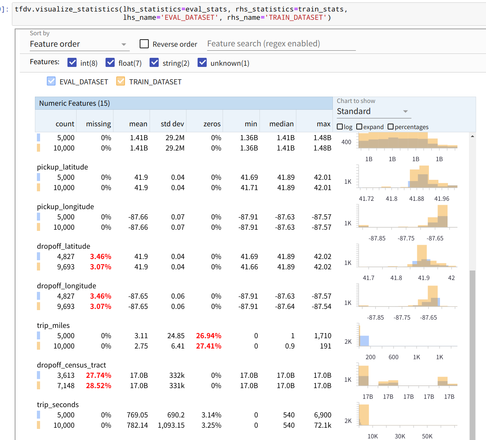
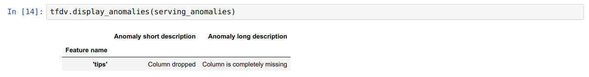
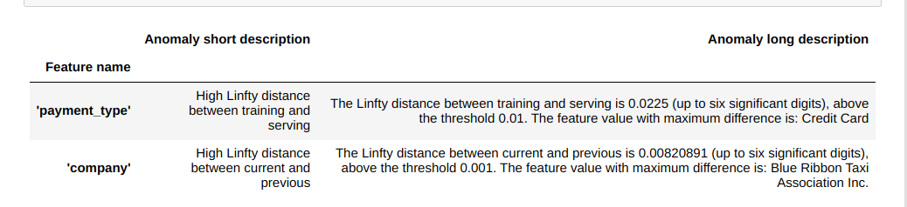
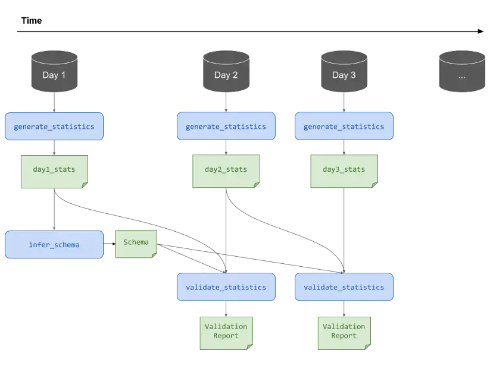

# TensorFlow Data Validation (TFDV)
https://www.tensorflow.org/tfx/guide/tfdv

https://medium.com/tensorflow/introducing-tensorflow-data-validation-data-understanding-validation-and-monitoring-at-scale-d38e3952c2f0


## 简介
它是用于分析和验证机器学习数据的库。它具有很强的扩容能力，可与 TensorFlow 和 TFX 配合使用。TFDV 包括：

- 对训练和测试数据的摘要统计信息进行可扩容计算。
- 与数据分布和统计信息查看器集成，以及对数据集对进行比较 (Facet)。
- 自动生成数据架构，以描述对所需值、范围和词汇表等数据的预期。
- 架构查看器，可帮助您检查架构。
- 异常检测，用于识别异常情况，例如缺少特征、值超出范围或特征类型有误，等等。
- 异常查看器，便于您查看哪些特征存在异常，并了解详情以进行修正。

## 安装
```shell
pip install tensorflow-data-validation
```

## 计算描述性数据统计

根据存在的特征及其值分布的形状提供数据的快速概览

```python
stats = tfdv.generate_statistics_from_csv(data_location=path)
tfdv.visualize_statistics(stats)
```


## 推断数据模式(schema)
模式描述了数据的预期属性。其中一些属性是：

- 预计会出现哪些功能
- 它们的类型
- 每个样本中，一个特征有几个值
- 所有样本中，每个特征的出现几率
- 预期的特征域

模式描述了对“正确”数据的期望，因此可用于检测数据中的错误

````python
schema = tfdv.infer_schema(stats) # 创建模式
tfdv.display_schema(schema=schema)
````


## 验证新数据

给定一个模式，可以检查数据集是否符合模式中设置的期望或是否存在任何数据异常。

(a) 通过将数据集的统计数据与模式进行匹配 \
(b) 通过检查每个示例的错误来检查整个数据集的聚合
```python
eval_stats = tfdv.generate_statistics_from_csv(data_location=eval_path)
anomalies = tfdv.validate_statistics(statistics=eval_stats, schema=schema)
tfdv.display_anomalies(anomalies)
```


```python
tfdv.visualize_statistics(lhs_statistics=eval_stats, rhs_statistics=train_stats,
                          lhs_name='EVAL_DATASET', rhs_name='TRAIN_DATASET')
```


## 模式环境
默认情况下，pipeline中的所有数据集都应使用相同的架构。在某些情况下，引入轻微的模式变化是必要的。例如，在监督学习中，需要在数据集中包括标签，但当应用模型进行推理时，则不包括标签。在某些情况下，有必要引入轻微的模式变化。

可以使用**环境**来表示此类需求。特别是，可以使用 default_environment、in_environment 和 not_in_environment 将模式中的特征与一组环境相关联。

例如，tips 特征被作为训练标签包含在此数据集中，但却没有包含在应用数据中。如果未指定环境，它将显示为异常。

```python
serving_stats = tfdv.generate_statistics_from_csv(SERVING_DATA)
serving_anomalies = tfdv.validate_statistics(serving_stats, schema)

tfdv.display_anomalies(serving_anomalies)
```


要解决此问题，需要将所有功能的默认环境设置为“TRAINING”和“SERVING”，并从 SERVING 环境中排除“tips”功能
```python
schema.default_environment.append('TRAINING')
schema.default_environment.append('SERVING')

# Specify that 'tips' feature is not in SERVING environment.
tfdv.get_feature(schema, 'tips').not_in_environment.append('SERVING')

serving_anomalies_with_env = tfdv.validate_statistics(
    serving_stats, schema, environment='SERVING')

tfdv.display_anomalies(serving_anomalies_with_env)
```
## 检查数据漂移和偏差
除了检查数据集是否符合模式中设置的预期外，TFDV 还提供检测功能：

- 训练数据和推理数据之间的偏差
- 在不同日期的训练数据之间漂移

TFDV 执行此检查的方式为：根据模式中指定的漂移/偏差比较器来比较不同数据集的统计信息。

支持对分类特征以及在数据的连续跨度之间（即跨度 N 和跨度 N+1 之间）进行漂移检测（例如训练数据的不同天数之间）。用切比雪夫距离来表示漂移，可以设置阈值，以便在漂移高于阈值时收到警告。设置正确的阈值通常是一个迭代过程，需要领域知识和实验。

TFDV 可以检测数据中三种不同类型的偏差：模式偏差、特征偏差和分布偏差。
- 架构偏差 \
当训练数据和应用数据不符合同一个架构时，会发生架构偏差。训练数据和应用数据都应遵循同一个架构。两者之间的任何预期偏差都应通过架构中的环境字段指定。

- 特征偏差 \
当模型训练所采用的特征值与它在推理时看到的特征值不同时，会发生特征偏差。例如，这可能在以下情况下发生：
提供某些特征值的数据源在训练时和推理时之间被修改。
用于在训练和推理之间生成特征的逻辑不同。

- 分布偏差 \
当训练数据集的分布与推理数据集的分布明显不同时，会发生分布偏差。分布偏差的主要原因之一是使用不同的代码或不同的数据源来生成训练数据集。另一个原因是错误的采样机制选择了数据中无代表性的子样本来进行训练。

TFDV 可以计算服务日志的统计数据并使用模式执行验证，同时考虑训练数据和服务数据之间的任何预期差异

```python
payment_type = tfdv.get_feature(schema, 'payment_type')
payment_type.skew_comparator.infinity_norm.threshold = 0.01

# Add drift comparator for 'company' feature.
company=tfdv.get_feature(schema, 'company')
company.drift_comparator.infinity_norm.threshold = 0.001

skew_anomalies = tfdv.validate_statistics(train_stats, schema,
                                          previous_statistics=eval_stats,
                                          serving_statistics=serving_stats)

tfdv.display_anomalies(skew_anomalies)
```


## 冻结模式

已经对模式进行了检查和整理，将其存储在文件中以反映其“冻结”状态。
```python
from tensorflow.python.lib.io import file_io
from google.protobuf import text_format

file_io.recursive_create_dir(OUTPUT_DIR)
schema_file = os.path.join(OUTPUT_DIR, 'schema.pbtxt')
tfdv.write_schema_text(schema, schema_file)
```
## 编写自定义数据连接器

为了计算数据统计数据，TFDV 提供了几种方法来处理各种格式的输入数（TFRecordtf.train.Example 、 CSV 等）。如果数据格式不在此列表中，需要编写一个自定义数据连接器来读取输入数据，并将其与 TFDV 核心 API 连接以计算数据统计信息。

计算数据统计的 TFDV 核心 API 是一个 Beam PTransform ，它采用输入batch样本的 PCollection（一批输入样本表示为Arrow RecordBatch），并输出包含单个DatasetFeatureStatisticsList协议缓冲区的 PCollection。

在 Arrow RecordBatch 中实现了对输入示例进行批处理的自定义数据连接器后，需要将其与 tfdv.GenerateStatisticsAPI 连接以计算数据统计信息。以TFRecord.train.Example为例，tfx_bsl提供 TFExampleRecord 数据连接器。

```python
import tensorflow_data_validation as tfdv
from tfx_bsl.public import tfxio
import apache_beam as beam
from tensorflow_metadata.proto.v0 import statistics_pb2

DATA_LOCATION = ''
OUTPUT_LOCATION = ''

with beam.Pipeline() as p:
    _ = (
    p
    # 1. Read and decode the data with tfx_bsl.
    | 'TFXIORead' >> (
          tfxio.TFExampleRecord(
              file_pattern=[DATA_LOCATION],
              telemetry_descriptors=['my', 'tfdv']).BeamSource())
    # 2. Invoke TFDV `GenerateStatistics` API to compute the data statistics.
    | 'GenerateStatistics' >> tfdv.GenerateStatistics()
    # 3. Materialize the generated data statistics.
    | 'WriteStatsOutput' >> WriteStatisticsToTFRecord(OUTPUT_LOCATION))
```

## 计算数据切片的统计数据

TFDV 可以配置为计算数据切片的统计数据。可以通过提供切片函数来启用切片，该函数接受一个 ArrowRecordBatch并输出一系列 form 的元组(slice key, record batch)。TFDV 提供了一种简单的方法来生成基于特征值的切片函数 ，这些函数可以作为tfdv.StatsOptions计算统计数据的一部分提供。

```python
import tensorflow_data_validation as tfdv
from tensorflow_data_validation.utils import slicing_util

# Slice on country feature (i.e., every unique value of the feature).
slice_fn1 = slicing_util.get_feature_value_slicer(features={'country': None})

# Slice on the cross of country and state feature (i.e., every unique pair of values of the cross).
slice_fn2 = slicing_util.get_feature_value_slicer(
    features={'country': None, 'state': None})

# Slice on specific values of a feature.
slice_fn3 = slicing_util.get_feature_value_slicer(
    features={'age': [10, 50, 70]})

stats_options = tfdv.StatsOptions(
    slice_functions=[slice_fn1, slice_fn2, slice_fn3])
```

## 验证持续到达的数据

在数据不断到达的情况下，需要根据模式中的期望对新数据进行验证。在典型的设置中，模式是跨时间维护的，根据新数据计算统计数据，这些统计数据用于根据原始模式验证这些数据。如上所述，最初推断模式是为了方便，但它会随着时间的推移而演变。

